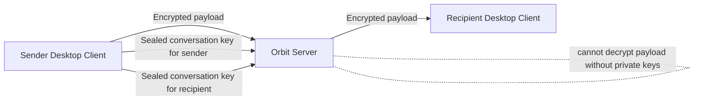
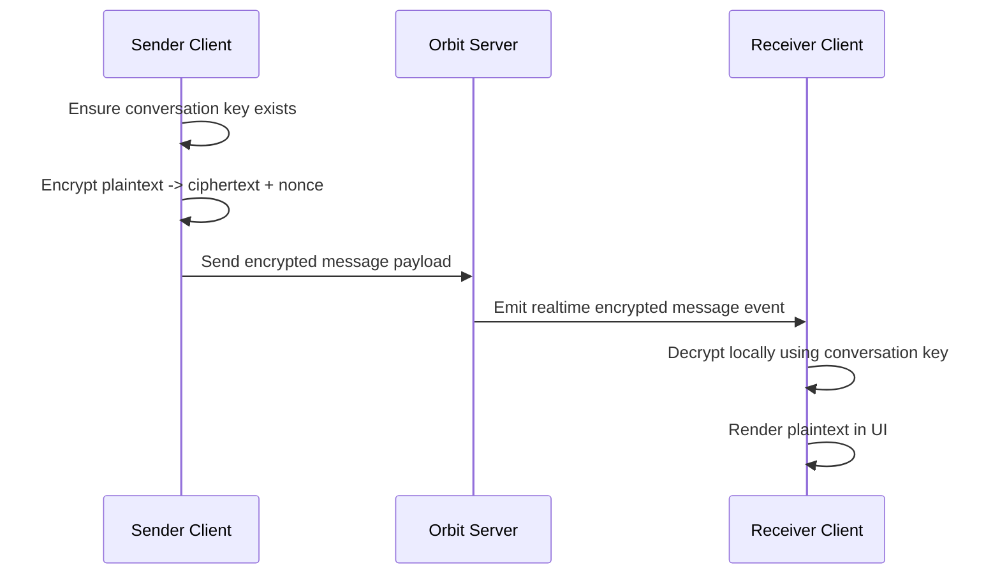

# Orbit Chat Desktop

Orbit Chat is a desktop direct-messaging app focused on private communication.

This app is designed so message text in one-to-one chats is end-to-end encrypted. The backend delivers and stores encrypted payloads, but does not hold the private keys needed to read message content.

## What This Is

Orbit Chat combines:

- a desktop shell (Electron)
- a chat interface (React)
- realtime delivery (websockets)
- client-side cryptography (libsodium)
- profile viewing and editing UI (popover + settings)

The desktop app talks to a separate backend service for identity, routing, persistence, and presence.

## What Is Actually Encrypted

Encrypted end-to-end:

- direct message text payloads (DM content)

Not encrypted end-to-end:

- who you talk to
- conversation membership
- message timestamps
- delivery and seen metadata
- profile data

In plain terms: the server can route messages and know chat structure, but should not be able to read encrypted DM text.

## Why It Is Considered Safe

Orbit Chat uses a layered model:

1. Transport security protects data in transit.
2. End-to-end encryption protects DM content even if transport or storage is inspected.
3. Device private keys remain on client devices.

Core safety properties:

- Message ciphertext is created on sender device.
- Message ciphertext is decrypted on recipient device.
- Server stores encrypted conversation keys and encrypted messages.
- Server does not perform plaintext decryption of DM payloads.

## Cryptography Model (Plain English)

There are two key types:

- Device keypair (public/private): one per device identity.
- Conversation key (symmetric): shared secret used to encrypt DM messages.

How a DM key is shared:

1. A random conversation key is generated.
2. That key is sealed separately to each participant's public key.
3. Server stores only the sealed versions.
4. Each device opens its own sealed copy using its private key.

How a message is sent:

1. Sender encrypts text with the conversation key.
2. Sender sends ciphertext + nonce.
3. Server relays/stores encrypted payload.
4. Recipient decrypts locally with the same conversation key.

Runtime behavior notes:

- If a DM key is still being prepared on first receive, UI may briefly show encrypted fallback text, then decrypt once key material is available.
- First-time inbound DM messages are delivered in realtime without requiring a re-login refresh.

## System Design

```text
Desktop App (Electron + React)
	|- Auth/session state
	|- Realtime socket client
	|- E2EE key management
	|- Encrypt/decrypt message content
					|
					| HTTPS + WSS
					v
Orbit Backend (NestJS)
	|- Auth + user profiles
	|- Conversation membership + message storage
	|- Encrypted conversation key storage
	|- Realtime fanout (Socket.IO conversation + user room delivery)
	|- Presence cache + optional media services
```

## Architecture View



## Example Message Flow



## Trust Boundaries

Client is trusted for:

- plaintext handling
- key generation
- encryption and decryption

Server is trusted for:

- auth decisions
- access control and membership checks
- storage durability
- message routing/realtime delivery (including first-time DM recipient fanout)

Server is not trusted for:

- reading plaintext DM content

## Important Limits (Honest Security Notes)

- Group chats are not fully E2EE in the same way as DMs.
- Metadata is still visible to backend.
- Private keys are currently stored in local app storage, not OS keychain.
- Fingerprint verification between users is not implemented.
- Forward secrecy and ratcheting are not implemented yet.

## Product Summary

Orbit Chat is a desktop-first secure messaging client where DM content is encrypted on-device and decrypted on-device, with backend infrastructure focused on identity, routing, and encrypted data transport rather than plaintext access.
