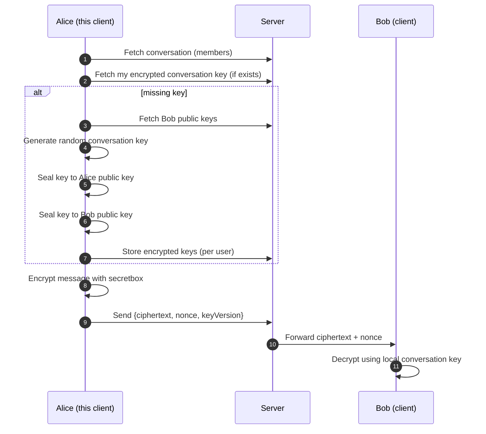

# Orbit Chat (Desktop)

Orbit Chat is an Electron desktop client (React + TypeScript) that supports **end-to-end encrypted (E2EE) direct messages**.

This README is intentionally security/architecture-first. It explains what is encrypted, what the server can and cannot see, and how the system fits together.

## What “Encrypted” Means Here

### Scope

- **Direct messages (DMs):** message content is E2EE.
- **Group chats:** not currently E2EE.
- **Metadata:** not E2EE (the server still sees who is talking to whom, message timestamps, and other operational metadata needed to deliver messages).

### Security goals

- A network attacker should not be able to read message contents.
- The server should not be able to decrypt DM message contents.
- Only devices that have the correct conversation key can decrypt messages.

### Threat model (practical)

- Transport is assumed to be protected (HTTPS/WSS), but **transport encryption is not the same as E2EE**.
- E2EE protects message content even if the server database is exposed.
- This client is **not a formally audited cryptosystem** and should be treated as “security-conscious” rather than “security-certified.”

## How DM E2EE Works

Orbit Chat uses `libsodium-wrappers` (libsodium) primitives:

- **Sealed boxes** (`crypto_box_seal` / `crypto_box_seal_open`) to encrypt (wrap) a per-conversation symmetric key to a user’s public key.
- **Secretbox** (`crypto_secretbox_easy` / `crypto_secretbox_open_easy`) to encrypt/decrypt message bodies with that symmetric key.

### Key types

- **Device keypair (asymmetric):** each user has a device keypair. The public key is registered with the server; the private key stays on the device.
- **Conversation key (symmetric):** each DM has a random symmetric key used to encrypt messages in that DM.

### Key distribution

When a DM is created (or when a DM is used and no key exists yet):

1. The sender creates a random conversation key.
2. The sender encrypts that conversation key separately to:
   - their own public key
   - the other user’s public key
3. The server stores **only the encrypted conversation keys**, indexed by `(conversationId, userId)`.

Each device decrypts its encrypted conversation key locally using its private key, and then uses the resulting symmetric key to decrypt messages.

### Message encryption

Each DM message is sent as:

- `ciphertext`: secretbox-encrypted message text
- `nonce`: unique per-message nonce
- `keyVersion`: currently `1` (room for future rotation)

The server forwards/stores `ciphertext` + `nonce` but cannot decrypt them without the conversation key.

## System Architecture

### Runtime components

```text
┌──────────────────────────────┐
│ Electron Main Process         │
│ - Creates BrowserWindow       │
│ - Owns app-level privileges   │
└───────────────┬──────────────┘
                │
                │ contextBridge (safe IPC surface)
                ▼
┌──────────────────────────────┐
│ Preload Script                │
│ - Exposes minimal APIs        │
│ - Keeps Node out of renderer  │
└───────────────┬──────────────┘
                │
                ▼
┌──────────────────────────────┐
│ React Renderer (UI)           │
│ - Auth + session state        │
│ - Socket connection           │
│ - Encrypt/decrypt DM messages │
└───────────────┬──────────────┘
                │ HTTPS/WSS
                ▼
┌──────────────────────────────┐
│ Orbit Server (separate repo)  │
│ - Auth + user profiles        │
│ - Conversation + message APIs │
│ - Stores encrypted DM keys    │
└──────────────────────────────┘
```

### Data-flow: sending a DM



## Where Things Live In This Repo

- `electron/main.ts`: Electron main process bootstrap
- `electron/preload.ts`: renderer-safe IPC bridge
- `src/App.tsx`: chat UI and message send/decrypt wiring
- `src/stores/e2eeStore.ts`: device key + conversation key management
- `src/lib/crypto.ts`: libsodium helpers (sealed box + secretbox)
- `src/stores/socketStore.ts`: Socket.io lifecycle
- `src/stores/messagesStore.ts`: in-memory message store

## Security Notes & Limitations (Important)

- **Multi-device E2EE is partial:** users can register multiple public keys, but conversation key storage is currently **per user**, not per device. A new device may not be able to decrypt older DMs unless a key is re-shared/rotated.
- **Key verification is not implemented:** there is no QR-code / fingerprint verification to detect MITM key-substitution by a malicious server.
- **Forward secrecy is not implemented:** if a conversation key is compromised, historical messages for that DM could be decrypted.
- **Local private key storage:** private keys are stored in the renderer’s storage (currently `localStorage`). This is convenient but not as strong as using OS keychain/secure storage.
- **E2EE covers message body only:** usernames, membership, timestamps, and delivery metadata are not end-to-end encrypted.

## Minimal Setup (Local)

This repo is the desktop client only; it requires a running backend.

- Create a `.env` from `.env.example`
- Set:
  - `VITE_API_URL`
  - `VITE_SOCKET_URL`

If you do need to run it locally:

- Install: `npm install --cache .npm-cache`
- Start dev app: `npm run dev`
