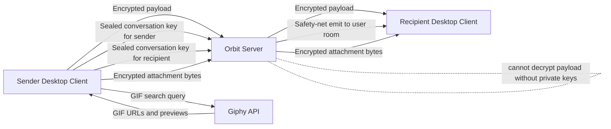
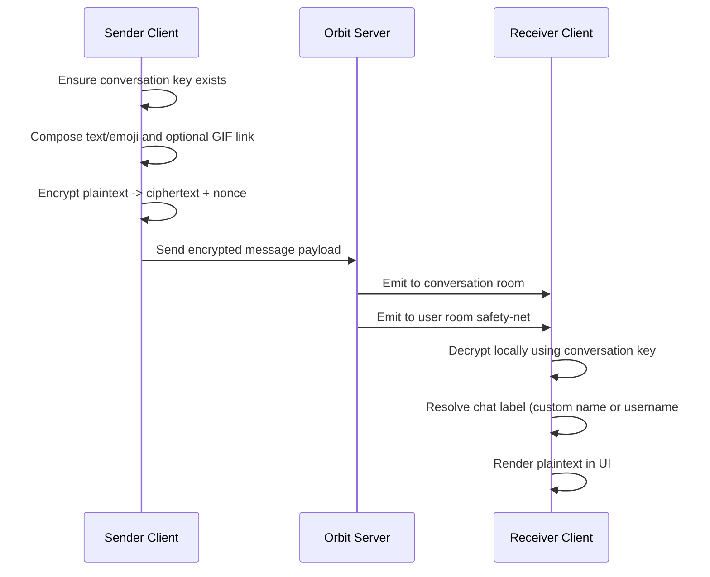
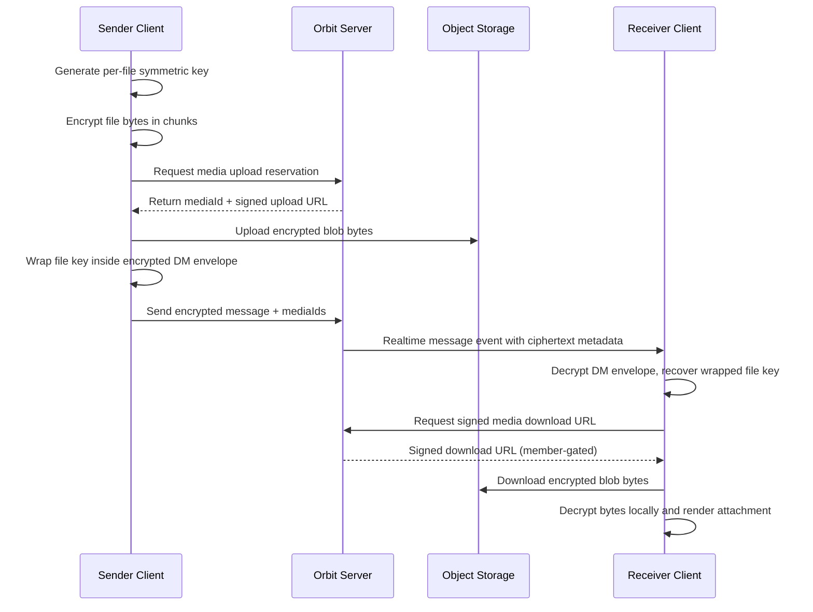
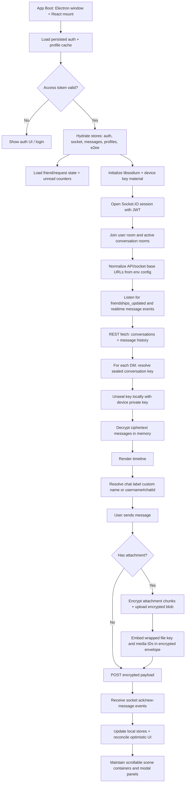
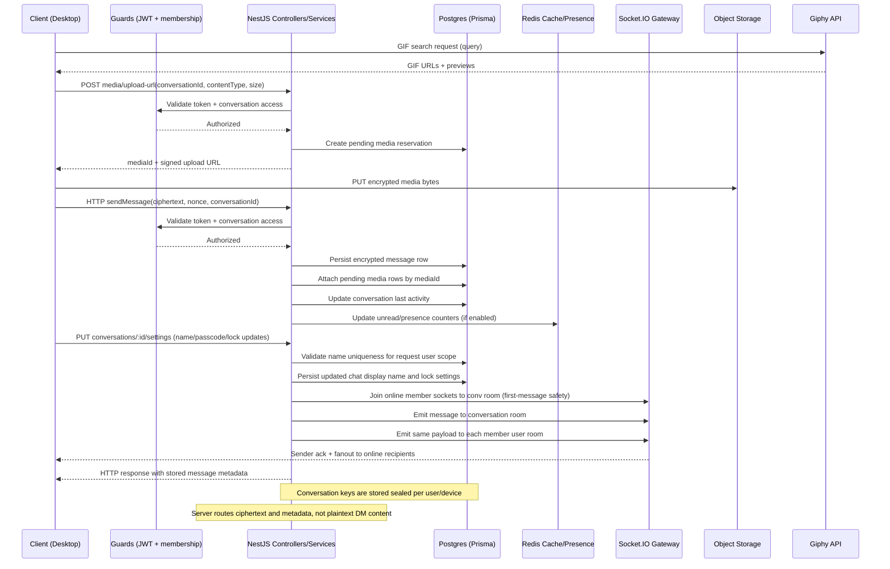

# Orbit Chat Desktop

Orbit Chat is a desktop direct-messaging app focused on private communication.

Current desktop package version: `0.6.0`.

This app is designed so message text in one-to-one chats is end-to-end encrypted. The backend delivers and stores encrypted payloads, but does not hold the private keys needed to read message content.

## What This Is

Orbit Chat combines:

- a desktop shell (Electron)
- a chat interface (React)
- realtime delivery (websockets)
- client-side cryptography (libsodium)
- profile viewing and editing UI (popover + settings)
- friend requests and friend list management
- account recovery code login and bypass flows
- per-chat passcode lock controls (on leave, on logout, timed, inactivity)
- encrypted attachment handling for files and images
- video link sharing (link-only, no direct video upload)
- GIF search and attach flow (Giphy API)
- searchable emoji picker with recents + keyboard navigation
- client-side unread badge tracking that clears on active chat selection
- chat display names editable in per-chat settings
- DM fallback labels using `@username#chatId` when no custom chat name is set
- full-scene scroll handling for auth, lock, modal, and app-shell views
- client URL normalization safeguards for malformed API/socket base URLs
- avatar rendering across DM and friends surfaces with initials fallback

The desktop app talks to a separate backend service for identity, routing, persistence, and presence.

For local development, set `VITE_API_URL` and `VITE_SOCKET_URL` in `.env` (from `.env.example`) so desktop traffic points to your intended backend. GIF search uses Giphy via `VITE_GIPHY_API_KEY`.

## What Is Actually Encrypted

Encrypted end-to-end:

- direct message text payloads (DM content)
- DM attachment metadata embedded in encrypted message envelopes
- DM video links embedded in encrypted message envelopes
- DM GIF links embedded in encrypted message envelopes
- attachment file keys wrapped inside encrypted message envelopes
- attachment file bytes uploaded as encrypted blobs

Not encrypted end-to-end:

- who you talk to
- conversation membership
- message timestamps
- delivery and seen metadata
- profile data
- media reservation metadata used for routing/storage (for example object key, lifecycle status, content type)

In plain terms: the server can route messages and know chat structure, but should not be able to read encrypted DM text.

## Why It Is Considered Safe

Orbit Chat uses a layered model:

1. Transport security protects data in transit.
2. End-to-end encryption protects DM content even if transport or storage is inspected.
3. Device private keys remain on client devices.

Core safety properties:

- Message ciphertext is created on sender device.
- Message ciphertext is decrypted on recipient device.
- Server stores encrypted conversation keys and encrypted messages.
- Server does not perform plaintext decryption of DM payloads.
- Attachment bytes are encrypted on sender device before upload.
- Attachment bytes are decrypted on recipient device after download.
- Video links are sent as encrypted message data, not as a server-parsed plaintext field.

## Cryptography Model (Plain English)

There are two key types:

- Device keypair (public/private): one per device identity.
- Conversation key (symmetric): shared secret used to encrypt DM messages.

How a DM key is shared:

1. A random conversation key is generated.
2. That key is sealed separately to each participant's public key.
3. Server stores only the sealed versions.
4. Each device opens its own sealed copy using its private key.

How a message is sent:

1. Sender encrypts text with the conversation key.
2. Sender sends ciphertext + nonce.
3. Server relays/stores encrypted payload.
4. Recipient decrypts locally with the same conversation key.

How an attachment is sent:

1. Sender generates a random per-file key.
2. Sender encrypts file bytes in chunks using that file key.
3. Sender uploads encrypted bytes to media storage using a signed upload URL.
4. Sender encrypts the file key inside the DM envelope and sends media ID references with the message.
5. Recipient decrypts the DM envelope, retrieves the wrapped file key, downloads encrypted bytes, and decrypts locally.

Runtime behavior notes:

- If a DM key is still being prepared on first receive, UI may briefly show encrypted fallback text, then decrypt once key material is available.
- First-time inbound DM messages are delivered in realtime without requiring a re-login refresh.
- Realtime duplicate safety delivery can arrive through both conversation and user rooms; client message upsert is id-based to prevent duplicate rows.
- Encrypted attachment delivery supports chunked encryption and in-session retry reuse for files already uploaded.
- Video attachments are currently link-only by design.
- GIF picker search and selection supports keyboard navigation, active-item highlighting, and outside-click/Escape dismiss.
- Emoji picker supports search tags, recent emoji shortcuts, and keyboard navigation.
- Unread counters are maintained client-side and reset immediately when a conversation becomes active.
- Chat settings support custom display names and passcode/lock updates in one panel.
- Locked/passcode prompts include the chat label so users can match the correct passcode to the correct DM instance.
- Scene containers are scroll-safe on smaller viewports (auth, passcode, main shell columns, and settings modal).
- API and socket base URLs are normalized client-side to reduce config mistakes (for example accidental `/:port` formatting).

## System Design

```text
Desktop App (Electron + React)
	|- Auth/session state
	|- Realtime socket client
	|- URL-normalized API/socket endpoint handling
	|- E2EE key management
	|- GIF + emoji composer workflows
	|- Encrypt/decrypt message content
					|
					| HTTPS + WSS
					v
Orbit Backend (NestJS)
	|- Auth + user profiles
	|- Friend graph + friend request workflows
	|- Conversation membership + message storage
	|- Chat display-name updates with uniqueness validation per user
	|- Encrypted conversation key storage
	|- Chat passcode verification + lock policy enforcement
	|- Recovery-code assisted passcode bypass
	|- Media reservation, signed upload/download URL issuance, and lifecycle cleanup
	|- Realtime fanout (Socket.IO conversation room + user room safety net)
	|- Friend list refresh events (`friendships_updated`)
	|- Presence cache + media services

External API
	|- Giphy search API (GIF discovery only)
```

## Architecture View



## Example Message Flow



## Media Encryption Flow



## Detailed Client Runtime Flow



## Detailed Server Processing Flow



## Trust Boundaries

Client is trusted for:

- plaintext handling
- key generation
- encryption and decryption

Server is trusted for:

- auth decisions
- access control and membership checks
- storage durability
- message routing/realtime delivery (including first-time DM recipient fanout)
- media reservation and signed URL issuance
- one-time media lifecycle cleanup

Server is not trusted for:

- reading plaintext DM content

## Important Limits (Honest Security Notes)

- Group chats are not fully E2EE in the same way as DMs.
- Metadata is still visible to backend.
- Private keys are currently stored in local app storage, not OS keychain.
- Fingerprint verification between users is not implemented.
- Forward secrecy and ratcheting are not implemented yet.
- Video files are intentionally disabled for direct upload (video links only).
- GIF discovery uses Giphy search endpoints (client-side query to external API).
- Attachment reservation metadata is handled server-side for access control and lifecycle management.
- Very large desktop installers are currently distributed as direct release artifacts, which may require LFS/CDN strategy over time.
- Current build config forces `libsodium-wrappers` to its CommonJS entry due to an upstream ESM packaging issue.

## Product Summary

Orbit Chat is a desktop-first secure messaging client where DM content is encrypted on-device and decrypted on-device, with backend infrastructure focused on identity, routing, and encrypted data transport rather than plaintext access.
