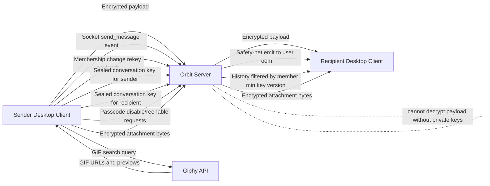
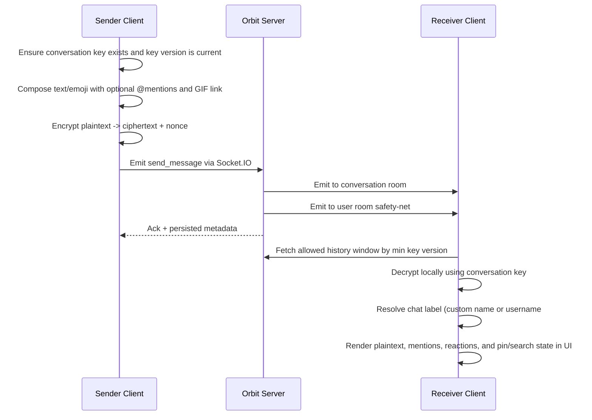
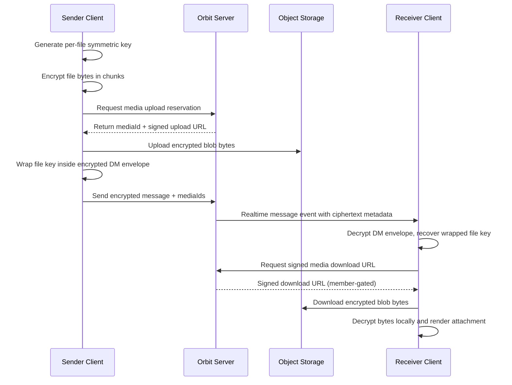
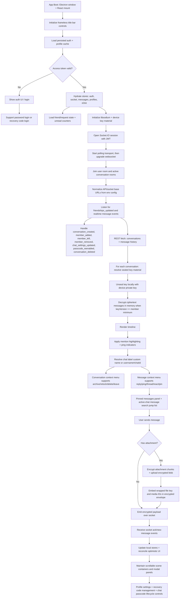
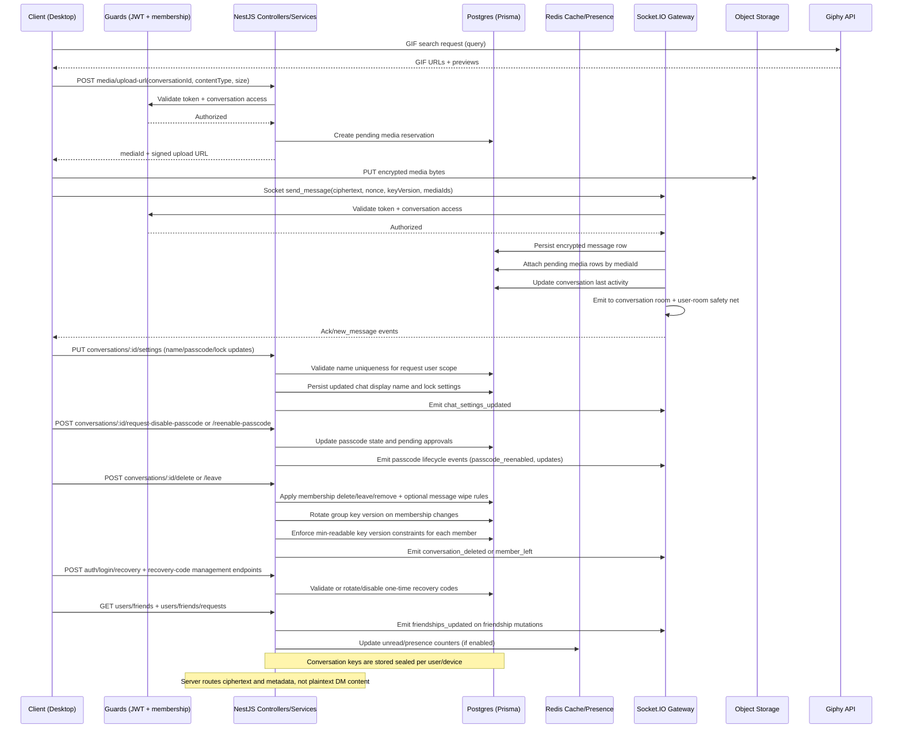

# Orbit Chat Desktop

Orbit Chat is a desktop messaging app focused on private communication.

Current desktop package version: `0.9.0`.

This app is designed so message text in direct and group chats is end-to-end encrypted. The backend delivers and stores encrypted payloads, but does not hold the private keys needed to read message content.

## What This Is

Orbit Chat combines:

- a desktop shell (Electron)
- a chat interface (React)
- realtime delivery (websockets)
- client-side cryptography (libsodium)
- profile viewing and editing UI (popover + settings)
- friend requests and friend list management
- account recovery code login and bypass flows
- recovery code lifecycle management (status, refresh, permanent disable with confirmation)
- per-chat passcode lock controls (on leave, on logout, timed, inactivity)
- two-party passcode disable approval and passcode re-enable generation flow
- encrypted attachment handling for images
- GIF search and attach flow (Giphy API)
- searchable emoji picker with recents + keyboard navigation
- expanded reactions with emoji + `:name:` shortcode support
- reaction details modal showing who reacted to each reaction
- Discord-style mention autocomplete (`@username`) with keyboard navigation
- mention highlighting with ping indicator styling in chat
- message-level context menu actions (reply, ping, thread, react, pin/unpin)
- chat-local message search with clickable jump-to-message results
- per-chat pinned messages panel with jump navigation
- client-side unread badge tracking that clears on active chat selection
- chat display names editable in per-chat settings
- DM fallback labels using `@username#chatId` when no custom chat name is set
- local archive/unarchive chat workflow with conversation context menu actions
- DM delete + unfriend flow and group leave flow with optional message wipe
- home/recent chats as default landing view with dedicated DM, Group Chats, Friends, and Archive tabs
- group member add flow with membership-change rekeying and history key-version access control
- server-side owner remove-member API with membership-change event fanout
- full-scene scroll handling for auth, lock, modal, and app-shell views
- client URL normalization safeguards for malformed API/socket base URLs
- avatar rendering across DM and friends surfaces with initials fallback
- frameless desktop shell with custom title bar window controls
- local pinned chat ordering and local pinned-message persistence

The desktop app talks to a separate backend service for identity, routing, persistence, and presence.

For local development, set `VITE_API_URL` and `VITE_SOCKET_URL` in `.env` (from `.env.example`) so desktop traffic points to your intended backend. GIF search uses Giphy via `VITE_GIPHY_API_KEY`.

## What Is Actually Encrypted

Encrypted end-to-end:

- direct message text payloads (DM content)
- group message text payloads (group content)
- attachment metadata embedded in encrypted message envelopes
- GIF links embedded in encrypted message envelopes
- attachment file keys wrapped inside encrypted message envelopes
- attachment file bytes uploaded as encrypted blobs
- `@mention` text as part of encrypted message payloads

Not encrypted end-to-end:

- who you talk to
- conversation membership
- message timestamps
- delivery and seen metadata
- profile data
- media reservation metadata used for routing/storage (for example object key, lifecycle status, content type)

In plain terms: the server can route messages and know chat structure, but should not be able to read encrypted message text.

## Why It Is Considered Safe

Orbit Chat uses a layered model:

1. Transport security protects data in transit.
2. End-to-end encryption protects chat content even if transport or storage is inspected.
3. Device private keys remain on client devices.

Core safety properties:

- Message ciphertext is created on sender device.
- Message ciphertext is decrypted on recipient device.
- Server stores encrypted conversation keys and encrypted messages.
- Server does not perform plaintext decryption of DM payloads.
- Group membership changes trigger key-version rotation and member-specific readable-version boundaries.
- Attachment bytes are encrypted on sender device before upload.
- Attachment bytes are decrypted on recipient device after download.
- Pasted links are encrypted as part of the DM message body, not parsed as separate plaintext media fields.

## Cryptography Model (Plain English)

There are two key types:

- Device keypair (public/private): one per device identity.
- Conversation key (symmetric): shared secret used to encrypt chat messages.

How a DM key is shared:

1. A random conversation key is generated.
2. That key is sealed separately to each participant's public key.
3. Server stores only the sealed versions.
4. Each device opens its own sealed copy using its private key.

How group key access is managed:

1. Group messages carry a key version.
2. Membership changes (add/remove/leave) rotate to a new group key version.
3. New members receive only the current sealed group key and start with that version as their minimum readable version.
4. History queries are constrained to each member's minimum readable key version.

How a message is sent:

1. Sender encrypts text with the conversation key.
2. Sender sends ciphertext + nonce.
3. Server relays/stores encrypted payload.
4. Recipient decrypts locally with the same conversation key.

How an attachment is sent:

1. Sender generates a random per-file key.
2. Sender encrypts file bytes in chunks using that file key.
3. Sender uploads encrypted bytes to media storage using a signed upload URL.
4. Sender encrypts the file key inside the DM envelope and sends media ID references with the message.
5. Recipient decrypts the DM envelope, retrieves the wrapped file key, downloads encrypted bytes, and decrypts locally.

Runtime behavior notes:

- If a conversation key is still being prepared on first receive, UI may briefly show encrypted fallback text, then decrypt once key material is available.
- First-time inbound DM messages are delivered in realtime without requiring a re-login refresh.
- Realtime duplicate safety delivery can arrive through both conversation and user rooms; client message upsert is id-based to prevent duplicate rows.
- Newer incoming key versions trigger local key refresh to keep membership-change rekeys in sync.
- Messages older than a member's readable key-version boundary are hidden from local decrypt/render.
- Encrypted attachment delivery supports chunked encryption and in-session retry reuse for images already uploaded.
- GIF picker search and selection supports keyboard navigation, active-item highlighting, and outside-click/Escape dismiss.
- Emoji picker supports search tags, recent emoji shortcuts, and keyboard navigation.
- Reaction input supports both direct emoji and `:name:` shortcode mapping.
- Reaction details modal lists participants per reaction on a message.
- Mention autocomplete supports arrow-key navigation and Enter/Tab insert.
- Message search is scoped to the active chat and results jump to message anchors.
- Message-level pin/unpin is available from the context menu, with a pinned panel in the chat header.
- Unread counters are maintained client-side and reset immediately when a conversation becomes active.
- Navigation now separates Home (recent chats), Direct Messages, Group Chats, Friends, and Archive surfaces.
- Chat settings support custom display names and passcode/lock updates in one panel.
- Chat settings include passcode disable-request approval and passcode re-enable generation events.
- New chat passcodes are shown once with deferred display handling for conversation lifecycle events.
- Locked/passcode prompts include the chat label so users can match the correct passcode to the correct DM instance.
- Friend data refreshes on focus/visibility and server `friendships_updated` events.
- Scene containers are scroll-safe on smaller viewports (auth, passcode, main shell columns, and settings modal).
- API and socket base URLs are normalized client-side to reduce config mistakes (for example accidental `/:port` formatting).
- Realtime transport starts with polling and upgrades to websocket for better proxy/firewall compatibility.
- Access tokens can be silently refreshed during API/socket auth failures to reduce forced re-logins.

## System Design

```text
Desktop App (Electron + React)
	|- Auth/session state
	|- Frameless title bar + desktop window controls
	|- Realtime socket client
	|- Home/DM/Group/Friends/Archive navigation surfaces
	|- Conversation context menu (archive/relock/delete or leave)
	|- Message context menu (reply/ping/thread/react/pin)
	|- Active-chat message search with jump-to-message results
	|- Per-chat pinned messages panel
	|- Mention autocomplete and ping highlighting
	|- URL-normalized API/socket endpoint handling
	|- E2EE key management
	|- Membership-change rekey handling (add/remove/leave)
	|- Per-member key-version decrypt boundary handling
	|- Recovery code display/login/management flows
	|- Chat passcode disable-approval + re-enable UX
	|- GIF + emoji composer workflows
	|- Reaction modal and emoji shortcode mapping
	|- Encrypt/decrypt message content
					|
					| HTTPS + WSS
					v
Orbit Backend (NestJS)
	|- Auth + user profiles
	|- Friend graph + friend request workflows
	|- Conversation membership + message storage
	|- Membership-change key rotation (group add/remove/leave)
	|- Per-member minimum readable key-version enforcement on history fetch
	|- Conversation delete/leave + optional message wipe behavior
	|- Chat display-name updates with uniqueness validation per user
	|- Encrypted conversation key storage
	|- Chat passcode verification + lock policy enforcement
	|- Passcode disable-request + re-enable event fanout
	|- Recovery-code assisted passcode bypass
	|- Media reservation, signed upload/download URL issuance, and lifecycle cleanup
	|- Realtime fanout (Socket.IO conversation room + user room safety net)
	|- Friend list refresh events (`friendships_updated`)
	|- Presence cache + media services

External API
	|- Giphy search API (GIF discovery only)
```

## Architecture View



## Example Message Flow



## Media Encryption Flow



## Detailed Client Runtime Flow



## Detailed Server Processing Flow



## Trust Boundaries

Client is trusted for:

- plaintext handling
- key generation
- encryption and decryption

Server is trusted for:

- auth decisions
- access control and membership checks
- storage durability
- message routing/realtime delivery (including first-time DM recipient fanout)
- media reservation and signed URL issuance
- one-time media lifecycle cleanup

Server is not trusted for:

- reading plaintext DM content

## Important Limits (Honest Security Notes)

- Group E2EE currently depends on centralized membership enforcement and server-coordinated key distribution metadata.
- Metadata is still visible to backend.
- Private keys are currently stored in local app storage, not OS keychain.
- Fingerprint verification between users is not implemented.
- Forward secrecy and ratcheting are not implemented yet.
- GIF discovery uses Giphy search endpoints (client-side query to external API).
- Attachment reservation metadata is handled server-side for access control and lifecycle management.
- Pinned chats and pinned messages are currently local-only (localStorage) and are not synced across devices.
- Very large desktop installers are currently distributed as direct release artifacts, which may require LFS/CDN strategy over time.
- In-app desktop auto-update flow is not enabled yet; users still install updates from release artifacts.
- Current build config forces `libsodium-wrappers` to its CommonJS entry due to an upstream ESM packaging issue.

## Product Summary

Orbit Chat is a desktop-first secure messaging client where direct and group chat content is encrypted on-device and decrypted on-device, with backend infrastructure focused on identity, routing, and encrypted data transport rather than plaintext access.
